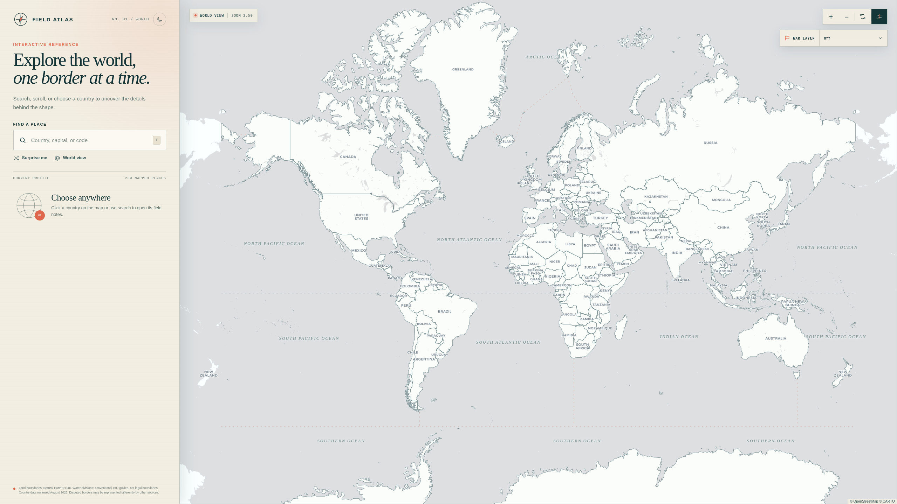
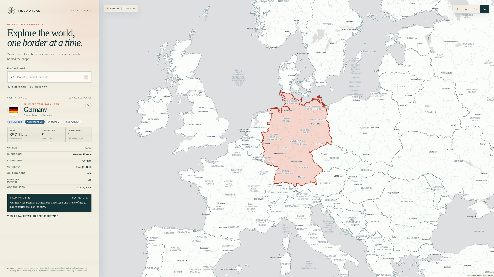

# World Map

A completely vibecoded (I literally touched no code) interactive world map; it includes fun facts, capitals, spoken languages, search, and a very pretty ui. Thank you Sam Altman for helping me become geographically literate. Run with: 
```shell
npm install 
npm run dev
```


