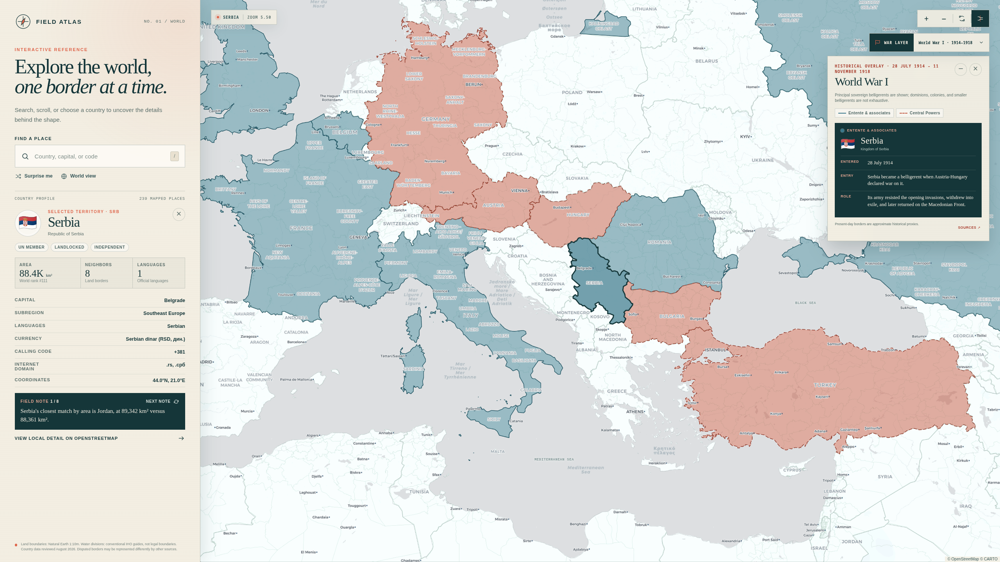

# World Map

A completely vibecoded interactive world map; it includes fun facts, country capitals, spoken languages, country search, and a very very pretty ui. I literally touched/read no code, so use at your own risk. Thank you Sam Altman for helping me become geographically literate. 

# Usage 

```shell
npm install 
npm run dev
```

# Information I Did Not Write or Review

Country metadata comes from `world-countries`, with a reviewed overlay for time-sensitive and role-sensitive fields. The overlay was last checked on 9 August 2026 against the [EU member-state list](https://european-union.europa.eu/principles-countries-history/eu-countries_en), the [NATO member-country list](https://www.nato.int/en/about-us/organization/nato-member-countries), the [European Commission euro-area list](https://economy-finance.ec.europa.eu/euro/eu-countries-and-euro_en), the [SIX ISO 4217 currency list](https://www.six-group.com/dam/download/financial-information/data-center/iso-currrency/lists/list-one.xml), and relevant official government sources. Boundaries come from Natural Earth through `world-atlas`; disputed boundaries and territorial groupings can differ between sources.

The optional war layers are curated, non-exhaustive views of principal belligerents and selected major contributors. They use present-day country polygons only as geographic proxies for historical states, empires, and changing borders. Entry dates refer to the declaration, invasion, deployment, or first combat event explained in each country factoid. Reference overviews include the [Imperial War Museums on World War I](https://www.iwm.org.uk/history/how-the-world-went-to-war-in-1914), the [US Holocaust Memorial Museum World War II timeline](https://encyclopedia.ushmm.org/content/en/article/world-war-ii-key-dates), [Encyclopaedia Britannica on the Korean War](https://www.britannica.com/event/Korean-War), and the [U.S. Office of the Historian on the Gulf War](https://history.state.gov/milestones/1989-1992/gulf-war).

# Screenshots 



